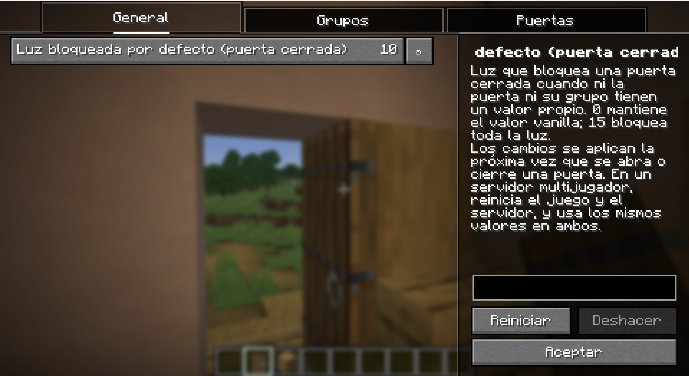

# Door Light Blocker

[](https://github.com/notNakura/door-light-blocker/actions/workflows/build.yml)
<!-- Add after publishing: Modrinth and CurseForge badges (e.g. https://modrinth.com/mod/door-light-blocker). -->

A small Fabric mod for Minecraft 1.21.11: **a closed door blocks light like a solid block, and an open door lets it through.**

In vanilla, doors are treated as transparent by the lighting engine, so sunlight and torch light leak through a closed door. This mod removes that leak for more realistic, darker interiors.

## Requirements

- Minecraft **1.21.11**
- [Fabric Loader](https://fabricmc.net/use/) 0.19.5 or newer
- [Fabric API](https://modrinth.com/mod/fabric-api) (0.141.6+1.21.11 or newer for 1.21.11)
- Java 21
- Optional: [Mod Menu](https://modrinth.com/mod/modmenu) and [YACL](https://modrinth.com/mod/yacl) for the in-game config screen

## Installation

The mod changes how light is calculated, so it must be installed on **both the client and the server**. Install it on a dedicated server and on every player's client; a mismatch causes visual light glitches.

1. Install Fabric Loader for Minecraft 1.21.11.
2. Put Fabric API and `door_light_blocker-<version>.jar` into the `mods` folder (client and server). Optionally add Mod Menu and YACL on the client for the config screen.
3. Start the game or server.

## Configuration

The config file is created on first start at `config/door_light_blocker.json`:

```json
{
  "default_closed_light_block": 15,
  "groups": {},
  "doors": {}
}
```

`groups` and `doors` are optional overrides and start empty, so `default_closed_light_block` applies to every door. For example, this blocks no light anywhere except iron doors and one specific door:

```json
{
  "default_closed_light_block": 0,
  "groups": { "iron": 15 },
  "doors": { "minecraft:oak_door": 7 }
}
```

Each value is the amount of light a **closed** door blocks, from `0` to `15`. `15` blocks all light (the default); `0` keeps the vanilla behavior for that door. Out-of-range values are clamped with a warning in the log.

- **Priority:** per-door value (`doors`, keyed by block id such as `"minecraft:oak_door"`), then the group override (`groups`), then `default_closed_light_block`. A group or door that is not listed inherits from the next level, so changing the default affects every door that has no override.
- **Groups:** `iron` is the iron door, `copper` is every copper door (including waxed and oxidized variants), `wooden` is the vanilla wood-type doors (oak, spruce, birch, acacia, cherry, jungle, dark oak, pale oak, mangrove, bamboo, crimson, warped), and `other` is any door from another mod whose block set type is none of these. The group comes from the door's block set type.
- A malformed file is reported in the log as an error and never overwritten; defaults are used until it is fixed.
- **Applying changes:** saving in the config screen takes effect without a restart in singleplayer and from the title screen. Light around a door updates when that door is opened or closed, so after changing the config, toggle doors to refresh them. Editing the file by hand, or changing it for a multiplayer setup, applies after restarting the game or server.
- **Multiplayer:** a dedicated server reads its own config file and needs a restart to apply changes (saving the screen while connected to a server does not change anything live). The client and the server must use the same config file, otherwise light will differ between them.

### Config screen

With [Mod Menu](https://modrinth.com/mod/modmenu) and [YetAnotherConfigLib (YACL)](https://modrinth.com/mod/yacl) installed, the Mods screen shows a config button for this mod. The screen has General, Groups and Doors categories; in Groups and Doors, an `Inherit` value removes that override from the file. Both mods are optional; without YACL the JSON file is the only way to configure the mod.

To open it: title screen → **Mods** → **Door Light Blocker** → config button. The screen is available in English and Spanish.



## Compatibility

- Works with all vanilla doors, including copper doors and their waxed/oxidized variants. Doors from other mods are covered as well and use the `other` group.
- Trapdoors and fence gates are not affected.
- Mods that replace the lighting engine or add light overhauls have not been tested.

## Performance

The light values are computed once per block state at startup, so there is no per-tick cost. The only runtime work is one local light update each time a door is opened or closed, which costs about as much as placing a block. Nothing is relit automatically after a config change; each door refreshes when it is opened or closed.

## Building from source

```bash
./gradlew build
```

The installable jar is `build/libs/door_light_blocker-<version>.jar`. Do not use the `-sources` jar.

Development setup: Java 21 (Temurin recommended) with `JAVA_HOME` set. Run `./gradlew vscode` after cloning to generate `.vscode/launch.json` (machine-specific, therefore not committed), then `./gradlew runClient` or `./gradlew runServer`.

## License

[MIT](LICENSE) (c) 2026 notNakura
